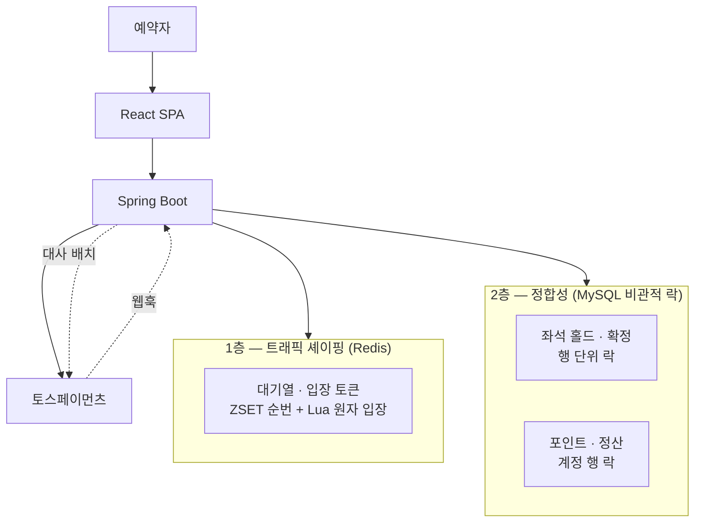

# PlaceHolder

> 좌석 제공자가 등록한 좌석을 예약자가 포인트로 예약하는 양면 마켓플레이스.
> **동시 요청이 몰리는 좌석 점유 시나리오에서 정합성을 보장하는 동시성 제어**가 핵심 주제다.

**관심 영역:** 실시간 처리 / 동시성이 핵심인 도메인 (티켓팅, 핀테크, 커머스)
**개발 기간:** 2026.05 ~ (1인, 백엔드 단독 + 검증용 프론트엔드)
**규모:** ADR 20종 · PR 28건 · 테스트 183건 (Testcontainers 기반 통합 테스트 포함)

---

## 이 프로젝트가 다루는 것

티켓팅 도메인은 **"돈과 좌석이 동시에 움직인다"**는 점에서 동시성 문제가 곧 금전 사고로 이어진다.
이 저장소는 그 경로를 하나씩 좁혀 나간 기록이다.

- 같은 좌석에 요청이 몰릴 때 **한 명만** 성공하는가
- 포인트 차감과 정산 적립이 **원자적**인가
- 결제가 중복 승인되거나, 승인됐는데 포인트가 안 들어오는 창이 있는가
- 취소·환불에서 **"돈은 돌려줬는데 포인트 회수 실패"** 같은 순손실이 가능한가
- 쿠폰으로 받은 포인트가 **현금으로 환전**될 수 있는가

각 결정의 근거는 [ADR 20종](docs/adr/README.md)으로 남겼고, 정합성 주장은 **테스트로 증명**하거나
증명하지 못한 경우 **미입증이라고 명시**했다.

---

## 기술 스택

| 분류 | 기술 |
|---|---|
| Language | Java 17 |
| Framework | Spring Boot 3.4, Spring Security, Spring Data JPA (Hibernate) |
| DB | MySQL 8.0 |
| Cache / Queue | Redis 7 (대기열), Caffeine (로컬 캐시) |
| Auth | JWT (jjwt 0.12.6) |
| 결제 | 토스페이먼츠 (REST, 카드) |
| Test | JUnit 5, AssertJ, **Testcontainers** (MySQL 격리) |
| Frontend | React 19, Vite, Tailwind CSS, axios |
| Infra | Docker Compose, GitHub Actions CI |
| 부하 테스트 | k6 |

---

## 아키텍처



**두 층은 역할이 다르다.** 대기열은 유입량을 조절할 뿐이고, **정합성은 전적으로 DB 락이 책임진다**
(ADR-013). Redis가 죽어도 좌석이 이중 판매되지 않는다 — 대기열은 통과시키기만 하고,
그 뒤에서 락이 다시 한 명만 통과시키기 때문이다.

---

## 핵심 작업

### 1. 좌석 점유 동시성 — "한 명만 성공한다"를 증명하기

| | |
|---|---|
| **Domain** | 인기 이벤트는 오픈 정각에 같은 좌석으로 요청이 몰린다 |
| **Problem** | 조회 후 갱신(read-modify-write) 구조에서는 두 요청이 같은 좌석을 각각 점유했다고 판단한다 |
| **Solution** | `SELECT ... FOR UPDATE`로 **좌석 행 단위** 락. 확정은 [포인트 차감 + 정산 적립 + CONFIRMED + 예약 생성 + 이력 2행]을 **단일 트랜잭션**으로 묶고, 잔액 부족 시 전체 롤백 |
| **Result** | 동시 10건 요청 → **정확히 1건 성공**. 만료 스케줄러와 confirm/hold가 겹치는 TOCTOU 경쟁 5종에서도 위반 없음 |

락 단위를 전역이 아닌 행으로 좁혀 **다른 좌석끼리는 경합하지 않는다.**
만료 처리는 스케줄러 폴링과 lazy 검증을 **병행**한다 — 스케줄러가 늦어도 확정 시점에 다시 확인한다.

> ADR-008 (락 전략 비교), ADR-009 (만료 전략)

### 2. N+1 발견 → 집계로 해결 — 유일하게 수치가 뒷받침되는 개선

| | |
|---|---|
| **Domain** | 이벤트 목록에 "잔여/총 좌석 수"를 표시해야 한다 |
| **Problem** | 순진하게 구현하니 이벤트마다 좌석을 세는 쿼리가 붙어 **1 + 2N 쿼리** |
| **Solution** | fetch join 대신 **`GROUP BY` 집계**. 좌석 엔티티를 메모리에 올리지 않고 DB가 세게 한다 |
| **Result** | 쿼리 **1+2N → 2**, 목록 조회 **p95 약 10배 개선** |

fetch join을 쓰지 않은 이유는 필요한 것이 *좌석 목록*이 아니라 *개수*이기 때문이다.
수천 석을 영속성 컨텍스트에 올려 세는 것은 같은 일을 더 비싸게 하는 것이다.

> ADR-011

### 3. 대기열 — 알려진 실패 모드에 대한 예방 설계

| | |
|---|---|
| **Domain** | 티켓팅은 오픈 정각에 트래픽이 수직 상승한다. 커넥션 풀 고갈은 이 도메인의 **교과서적 실패 모드**다 |
| **Problem** | 유입을 그대로 흘리면 풀이 마르고, 그 순간 좌석과 무관한 요청까지 연쇄 지연된다 |
| **Solution** | Redis ZSET 순번 + **Lua 스크립트로 입장을 원자화**(전역 동시 세션 상한 + 초당 입장률). 이벤트 간에는 **work-conserving 균등 RR**로 기아 방지 |
| **Result** | 다중 인스턴스에서도 상한 초과·중복 입장 불가. 33틱 실시간 시나리오에서 **기아 0회**, 짧은 큐의 잉여가 낭비 없이 재분배됨 |

대기열 진입 → 순번 폴링 → 입장 → 좌석 조회·홀드까지 전 구간이 동작하며,
이탈 시 순번·입장 토큰·좌석 홀드를 즉시 회수한다(브라우저 E2E 검증).

**측정으로 확인한 것과 확인하지 못한 것** (D-2)

- **확인:** 병목은 커넥션 풀이 아니라 **이 PC의 CPU**(~880 req/s)였고, 적정 풀 크기는 기본값 10으로
  **튜닝이 불필요**했다. 측정이 가설을 **세 번 교정**했다(풀이 병목이다 → 아니다 → 10 미만에서는 맞다)
- **확인하지 못한 것:** 서버가 실제로 무너지는 지점. 앱·DB·부하생성기가 한 PC를 공유해
  **생성기가 먼저 병목**이 됐다(coordinated omission). 그래서 **입장 상한·초당 입장률 값은
  실측이 아니라 추정**이다 — 기능의 타당성이 아니라 파라미터 근거가 비어 있다

> ADR-013 (대기열 설계), ADR-017 (입장 분배), `loadtest/HANDOFF-D2.md`

### 4. 결제 — 정합성 축과 생애주기 축

| | |
|---|---|
| **Domain** | 현금으로 포인트를 충전한다. 부작용이 **비가역적인 "돈"** 이다 |
| **Problem** | 승인은 됐는데 적립이 안 되는 창, 중복 적립, 금액 위변조, 외부 지연 전파 |
| **Solution** | **삼중화** — 동기 승인(주) + 웹훅(보조) + **대사 배치**(양쪽 다 실패했을 때). 셋 모두 `orderId` 비관적 락 기반의 **같은 멱등 코어**로 수렴한다 |
| **Result** | confirm × 웹훅 × 대사가 동시에 도착해도 **적립 정확히 1회**. 실제 토스 결제·취소 양방향 관통 확인 |

**트랜잭션 경계가 이 설계의 핵심이다.** 토스 호출을 `@Transactional` 안에 두면 네트워크 지연만큼
커넥션과 행 락을 붙잡는다 → ①검증 → ②**트랜잭션 밖** 외부 호출 → ③짧은 멱등 적립으로 분리했다.

**취소는 결제보다 어렵다.** 결제는 "외부 성공 + 내부 실패"를 멱등 재시도로 수렴시킬 수 있지만,
취소는 *"돈은 돌려줬는데 포인트 회수 실패"* 가 곧 순손실이다. 그래서 순서를 뒤집어
**되돌릴 수 있는 쪽(우리 DB)을 먼저, 되돌릴 수 없는 쪽(토스)을 나중에** 친다.

실제 E2E에서 `canceled_at` → `cancel_confirmed_at`이 **1.3초 벌어지는 것**을 관측했다 —
설계한 보상 순서가 실제 네트워크 왕복으로 일어났다는 증거이자, 그 사이가 곧 크래시 창이다.

> ADR-018 (PG 연동), ADR-019 (취소·환불 보상 트랜잭션)

### 5. self-review가 찾아낸 금전 구멍 두 건

기능이 아니라 **"구멍의 부재"** 를 증명한 사례다. 두 건 모두 **음성 대조군**을 먼저 확보했다 —
고치기 전에 테스트를 돌려 **실패를 확인**했다. 통과해버리면 그 테스트는 구멍을 재현하지 못한 것이므로
안전망이 아니다.

**(a) 쿠폰 → 현금 환전** (ADR-020)

환불액을 `min(주문 잔여액, 계정 잔액)`으로 산정했는데, 잔액이 쿠폰분과 현금분이 섞인 단일 정수였다.
`현금 충전 → 좌석에 소진 → 쿠폰 상환 → 결제 취소` 순서로 **쿠폰이 현금으로 환전**됐다(좌석은 그대로).

→ 게임 재화의 표준형인 **3계층**(기간제/무료/유료)으로 분리. 소모는 *"사라질 것부터"*,
환불은 **유료 재원에서만**. 이 순서가 양끝을 막는다 — 반대로 가면 각각 사용자와 서비스가 손해를 본다.

**(b) 제공자 정산액 lost update** (PR #28)

확정 경로가 제공자 계정을 **락도 `@Version`도 없이** read-modify-write 하고 있었다.
서로 다른 예약자가 같은 제공자의 **다른** 좌석을 동시에 사면 좌석 락도 예약자 계정 락도
이들을 직렬화하지 못한다.

```
동시 확정 10건 → 전부 성공
SETTLE 이력    → 10행 (정상)
정산 잔액      → 5,000   ← 50,000이어야 한다. 9건 유실
```

**이력은 INSERT라 덮어쓸 것이 없고, 잔액은 UPDATE라 덮어써진다.**
같은 사실을 두 곳에 저장하면서 갱신 방식이 달라 갈라진 것이다.
비관적 락으로 차단하고, 락 획득을 트랜잭션 **맨 마지막**으로 옮겨 보유 구간을 최소화했다.

남은 상한(같은 제공자의 판매가 그 행에서 직렬화)은 **의도적으로 남겼다** —
*상한이 존재한다*와 *그것이 병목이다*는 다른 주장이고, 후자는 측정된 적이 없다.
측정 설계는 [별도 문서](docs/performance/provider-settlement-throughput.md)로 분리했다.

---

## 정산 ≠ 지급 (법적 맥락)

실제 티켓 플랫폼의 제공자 정산은 PG 정산·결제대금예치 레일을 통한 **계좌 송금**으로,
전자금융업·결제대금예치업 라이선스가 필요한 영역이다.

이 프로젝트에서 제공자에게 흐르는 포인트는 **정산 예정액 집계**까지만 모델링하고,
실제 현금 출금·송금은 **의도적으로 범위에서 제외**했다.

도메인을 따라가며 마주친 법적 맥락은 설계에 그대로 반영돼 있다:

| 맥락 | 반영 |
|---|---|
| 전자상거래법 청약철회 7일 | 결제 취소 기한 (ADR-019) |
| 포인트 충전의 선불 성격 (이용자 자금 보호) | 충전 한도·감사 로그는 **미구현으로 명시**, 요건 확인 필요 항목으로 관리 |
| 재원 소멸의 사전 고지 의무 | 기간제 포인트 소멸을 넣지 않은 이유 중 하나 (ADR-020) |

---

## 실행 방법

**사전 요구:** Docker, JDK 17

```bash
# 1. MySQL + Redis 기동
docker compose up -d

# 2. 환경 변수 (.env)
#    DB_USERNAME / DB_PASSWORD / TOSS_CLIENT_KEY / TOSS_SECRET_KEY

# 3. 백엔드 (:8080)
./mvnw spring-boot:run -Dspring-boot.run.arguments=--spring.config.import=optional:file:.env[.properties]

# 4. 프론트엔드 (:5173)
cd frontend && npm install && npm run dev
```

**테스트** — Testcontainers가 MySQL을 자동 기동하므로 Docker만 떠 있으면 된다.

```bash
./mvnw test
```

> Windows는 `mvnw.cmd`. 결제 기능은 토스 테스트 키가 없으면 주문 생성까지만 동작한다.

---

## 문서

| 문서 | 내용 |
|---|---|
| [docs/adr/README.md](docs/adr/README.md) | **ADR 20종 인덱스** — 주제별 묶음, 기각한 대안, 결정 간 관계 |
| [docs/placeholder_master_plan.md](docs/placeholder_master_plan.md) | 전체 Phase 계획 |
| [docs/placeholder_table_definitions.md](docs/placeholder_table_definitions.md) | 테이블 정의서 |
| [docs/sql/schema.sql](docs/sql/schema.sql) | DDL |
| [docs/performance/](docs/performance/) | 측정 계획 및 확장성 백로그 |
| [loadtest/](loadtest/) | k6 부하 테스트 스크립트 |

**ADR 하이라이트**

| ADR | 결정 |
|---|---|
| [008](docs/adr/ADR-008-lock-strategy.md) | 좌석 홀드 락 전략 — 비관적 락 vs 낙관적 락 vs 유니크 제약 |
| [009](docs/adr/ADR-009-expiry-strategy.md) | 만료 해제 — lazy 재점유 vs 스케줄러 폴링 |
| [011](docs/adr/ADR-011-n-plus-one-group-by-aggregation.md) | N+1 해결 — GROUP BY 집계 vs fetch join |
| [013](docs/adr/ADR-013-queue-design.md) | 대기열 — Redis 기반 트래픽 보호 레이어 |
| [018](docs/adr/ADR-018-payment-pg-integration.md) | PG 연동 — 동기 승인 + 웹훅 이중화, 멱등 수렴 |
| [019](docs/adr/ADR-019-payment-cancel-refund.md) | 취소·환불 — 되돌릴 수 없는 쪽을 나중에 치기 |
| [020](docs/adr/ADR-020-point-bucket-separation.md) | 포인트 재원 분리 — 무료/유료를 섞으면 쿠폰이 현금이 된다 |

---

## 기술적 초점

- **동시성 제어** — 같은 좌석에 동시 N건이 몰려도 좌석·포인트·정산이 깨지지 않음을 테스트로 증명.
  락 단위를 행으로 좁힌 근거와 대안 비교를 ADR로 문서화
- **트랜잭션 경계 설계** — 외부 API 호출을 트랜잭션 밖으로 빼내 커넥션·락 점유를 끊고,
  멱등 코어를 별도 빈으로 분리해 self-invocation 함정을 회피
- **측정이 설계를 바꾼 사례** — N+1을 집계로 전환해 p95 약 10배 개선.
  반대로 부하 측정에서는 **생성기 병목으로 결론을 낼 수 없었음을 그대로 기록**
- **결함을 스스로 찾고 증명한 사례** — self-review로 금전 구멍 2건 발견,
  **고치기 전에 실패를 재현**해 안전망임을 확인한 뒤 수정
- **도메인 깊이** — 정산 구조를 설계하며 전자금융업 규제 맥락까지 파악하고 의도적으로 범위 설정
