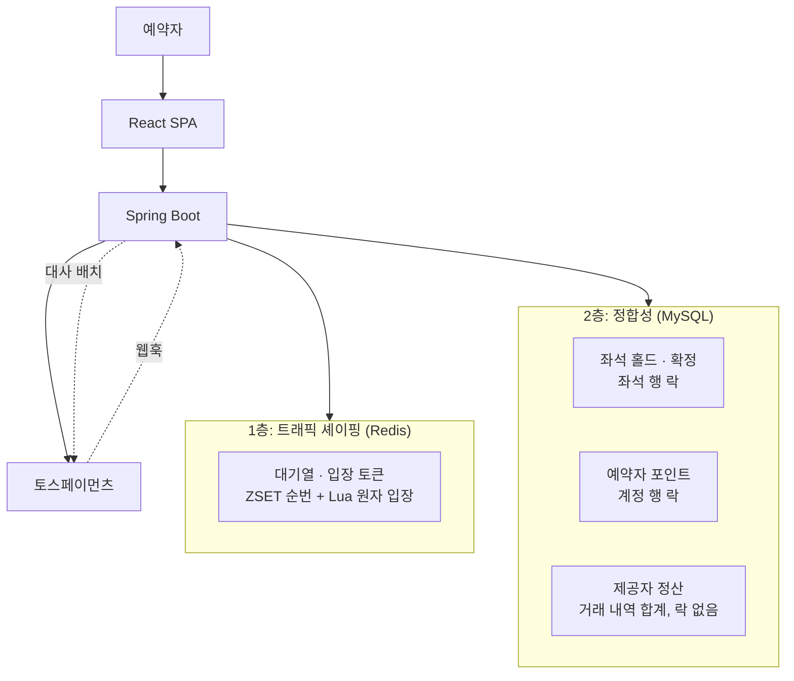

# PlaceHolder

> 좌석 제공자가 등록한 좌석을 예약자가 포인트로 예약하는 양면 마켓플레이스.
> 동시 요청이 몰리는 좌석 점유 상황에서 정합성을 보장하는 동시성 제어가 핵심 주제다.

- **관심 영역:** 실시간 처리 / 동시성이 핵심인 도메인 (티켓팅, 핀테크, 커머스)
- **개발 기간:** 2026.05 ~ (1인, 백엔드 단독 + 검증용 프론트엔드)
- **규모:** ADR 22종 · PR 38건 · 테스트 231건 (Testcontainers 기반 통합 테스트 포함)

---

## 이 프로젝트가 다루는 것

티켓팅에서는 돈과 좌석이 동시에 움직이기 때문에, 동시성 문제가 곧 금전 사고로 이어진다.
아래 질문들을 하나씩 다뤘다.

- 같은 좌석에 요청이 몰릴 때 한 명만 성공하는가
- 포인트 차감과 정산 적립이 원자적인가
- 결제가 중복 승인되거나, 승인됐는데 포인트가 안 들어오는 경우가 있는가
- 취소·환불에서 돈은 돌려줬는데 포인트는 회수하지 못하는 손실이 가능한가
- 쿠폰으로 받은 포인트가 현금으로 환전될 수 있는가

결정의 근거는 [ADR 22종](docs/adr/README.md)에 남겼다. 정합성에 관한 주장은 테스트로 확인했고,
확인하지 못한 것은 그렇다고 적었다.

---

## 기술 스택

| 분류 | 기술 |
|---|---|
| Language | Java 17 |
| Framework | Spring Boot 3.4, Spring Security, Spring Data JPA (Hibernate) |
| DB | MySQL 8.0 |
| Cache / Queue | Redis 7 (대기열), Caffeine (로컬 캐시) |
| Auth | JWT (jjwt 0.12.6) |
| 결제 | 토스페이먼츠 (REST, 카드) |
| Test | JUnit 5, AssertJ, Testcontainers (MySQL 격리) |
| Frontend | React 19, Vite, Tailwind CSS, axios |
| Infra | Docker Compose, GitHub Actions CI |
| 부하 테스트 | k6 |

---

## 아키텍처


```mermaid
flowchart TB
    U[예약자] --> FE[React SPA]
    FE --> API[Spring Boot]

    subgraph L1["1층: 트래픽 셰이핑 (Redis)"]
        Q[대기열 · 입장 토큰<br/>ZSET 순번 + Lua 원자 입장]
    end

    subgraph L2["2층: 정합성 (MySQL)"]
        S[좌석 홀드 · 확정<br/>좌석 행 락]
        P[예약자 포인트<br/>계정 행 락]
        L[제공자 정산<br/>거래 내역 합계, 락 없음]
    end

    API --> L1
    API --> L2
    API --> TOSS[토스페이먼츠]
    TOSS -.웹훅.-> API
    API -.대사 배치.-> TOSS
```

대기열은 유입량만 조절하고, 정합성은 DB 락이 책임진다(ADR-013). 그래서 Redis가 죽어도
좌석이 이중 판매되지 않는다. 대기열이 요청을 그대로 통과시켜도 좌석 행 락에서 한 명만 성공한다.

---

## 핵심 작업

### 1. 좌석 점유 동시성

| | |
|---|---|
| **Domain** | 인기 이벤트는 오픈 정각에 같은 좌석으로 요청이 몰린다 |
| **Problem** | 조회 후 갱신(read-modify-write) 구조에서는 두 요청이 같은 좌석을 각각 점유했다고 판단한다 |
| **Solution** | `SELECT ... FOR UPDATE`로 좌석 행 단위 락. 확정은 포인트 차감, 정산 적립, CONFIRMED 전이, 예약 생성, 이력 2행을 단일 트랜잭션으로 묶고 잔액이 부족하면 전체 롤백 |
| **Result** | 동시 10건 요청 중 정확히 1건 성공. 만료 스케줄러와 confirm/hold가 겹치는 TOCTOU 경쟁 5종에서도 위반 없음 |

락 단위를 좌석 행으로 좁혀서 서로 다른 좌석끼리는 경합하지 않는다.
만료 처리는 스케줄러 폴링과 lazy 검증을 함께 쓴다. 스케줄러가 늦어도 확정 시점에 한 번 더 확인한다.

> ADR-008 (락 전략 비교), ADR-009 (만료 전략)

### 2. N+1 → 집계 쿼리

| | |
|---|---|
| **Domain** | 이벤트 목록에 잔여/총 좌석 수를 표시해야 한다 |
| **Problem** | 이벤트마다 좌석을 세는 쿼리가 붙어 1 + 2N 쿼리 |
| **Solution** | fetch join 대신 `GROUP BY` 집계. 좌석 엔티티를 메모리에 올리지 않고 DB에서 센다 |
| **Result** | 쿼리 1+2N → 2, 목록 조회 p95 357ms → 36ms (이벤트 100개, VU 10) |

필요한 것은 좌석 목록이 아니라 개수라서 fetch join을 쓰지 않았다.
수천 석을 영속성 컨텍스트에 올려서 세는 것은 같은 결과를 더 비싸게 얻는 방법이다.

> ADR-011

### 3. 정산 처리량 측정 → 잔액 컬럼 제거

| | |
|---|---|
| **Domain** | 인기 이벤트에서는 한 제공자의 좌석 여러 개가 동시에 팔린다 |
| **Problem** | 정산 잔액 lost update를 비관적 락으로 막은 뒤([6-b](#b-제공자-정산액-lost-update)), 같은 제공자의 판매가 계정 행 하나에서 직렬화됐다 |
| **Solution** | 잔액 컬럼을 없애고, 확정 시 `SETTLE` 행만 INSERT한 뒤 잔액은 조회 시 합계로 계산 |
| **Result** | 한 제공자에 몰린 확정 처리량 85 → 304건/초(3.6배), 지연 p50 347 → 92ms. 요구 기준선(100건/초)의 약 3배 |

**측정 방법.** 부하생성기를 다른 머신으로 분리할 수 없어서 절대 처리량 대신 형태를 쟀다.
제공자 수를 1·2·4·8로 바꿔 가며 처리량 변화를 보면, 같은 PC의 오염은 두 실험군에 똑같이 들어가
비율에서 상쇄된다. 하네스는 JUnit에서 서비스를 직접 호출하는 방식이라 k6 같은 외부 생성기가 없다.

| 재설계 전 측정 | 값 |
|---|---|
| 제공자 1명일 때 처리량 | 초당 약 85건 |
| 지연 중 락 대기 비중 | 93% |
| `1 ÷ 락 보유시간`으로 계산한 상한 vs 실측 | 91 vs 88.1건/초 (오차 4%) |

계산값과 실측이 맞아서, 느린 원인이 이 행의 락이라고 특정할 수 있었다.

**락만 없애서는 부족했다.** 비교군으로 `FOR UPDATE`만 뺐더니 1.4배 개선에 그쳤다.
`UPDATE settlement_balance`가 남아 있어서 커밋 시점에 같은 행이 다시 잠기기 때문이다.
락 보유 11ms도 대부분 커밋 시간이었다. 트랜잭션 안에서 그 행에 쓰는 한 대기는 남으므로,
원자적 `UPDATE ... SET balance = balance + ?` 같은 대안도 같은 이유로 제외했다.
그래서 쓰기 대상 자체를 없앴다. 덮어쓸 컬럼이 없으니 lost update도 구조적으로 발생하지 않는다.

**남은 차이.** 재설계 후에도 제공자 1명일 때가 8명일 때보다 1.5배 느렸다. 이벤트 수와 제공자 수를
분리해 다시 재 보니 원인은 제공자가 아니라 이벤트였다. Hibernate는 기본적으로 바뀌지 않은 컬럼까지
UPDATE하는데, 그중 `event_id`·`label`이 유니크 인덱스(`uk_seats_event_label`)를 구성해서
한 이벤트의 좌석 확정이 인덱스의 같은 영역에 몰렸다. `Seat`에 `@DynamicUpdate`를 적용해
같은 이벤트 확정 처리량을 266 → 323건/초로 올렸고, 차이는 1.25배로 줄었다.
나머지는 정합성과 무관하고 기준선을 넘기 때문에 더 쫓지 않았다.

측정 횟수도 고쳤다. 재설계 후에는 회차 간 변동이 8%에서 41%로 커져서, 2회 측정으로 내린 판단이
5회 측정에서 뒤집혔다.

> ADR-021, [측정 문서](docs/performance/provider-settlement-throughput.md)

### 4. 대기열: 알려진 실패 모드에 대한 예방 설계

| | |
|---|---|
| **Domain** | 티켓팅은 오픈 정각에 트래픽이 급증한다. 커넥션 풀 고갈은 이 도메인의 대표적인 실패 모드다 |
| **Problem** | 유입을 그대로 받으면 풀이 고갈되고, 좌석과 무관한 요청까지 함께 지연된다 |
| **Solution** | Redis ZSET 순번 + Lua 스크립트로 입장을 원자화(전역 동시 세션 상한 + 초당 입장률). 이벤트 간에는 균등 라운드로빈 + 잉여 재분배로 기아 방지 |
| **Result** | 인스턴스가 여러 대여도 상한 초과·중복 입장 불가. 33틱 시나리오에서 기아 0회, 짧은 큐의 남는 몫은 다른 큐로 재분배 |

대기열 진입, 순번 폴링, 입장, 좌석 조회·홀드까지 전 구간이 동작한다.
사용자가 이탈하면 순번·입장 토큰·좌석 홀드를 즉시 회수한다(브라우저 E2E 검증).

**측정으로 확인한 것과 확인하지 못한 것** (D-2)

- **확인:** 병목은 커넥션 풀이 아니라 이 PC의 CPU(~880 req/s)였고, 적정 풀 크기는 기본값 10이라
  튜닝이 필요 없었다. 측정하면서 가설을 세 번 고쳤다(풀이 병목이다 → 아니다 → 10 미만에서는 맞다).
- **확인하지 못한 것:** 서버가 실제로 무너지는 지점. 앱·DB·부하생성기가 한 PC를 공유해서
  생성기가 먼저 병목이 됐다(coordinated omission). 그래서 입장 상한과 초당 입장률은
  실측값이 아니라 추정값이다.

> ADR-013 (대기열 설계), ADR-017 (입장 분배), `loadtest/HANDOFF-D2.md`

### 5. 결제: 승인 정합성과 취소·환불

| | |
|---|---|
| **Domain** | 현금으로 포인트를 충전한다. 되돌릴 수 없는 돈이 오간다 |
| **Problem** | 승인됐는데 적립이 안 되는 경우, 중복 적립, 금액 위변조, 결제사 지연이 다른 기능으로 번지는 문제 |
| **Solution** | 동기 승인(주) + 웹훅(보조) + 대사 배치(둘 다 실패했을 때). 세 경로 모두 `orderId` 비관적 락 기반의 같은 멱등 처리로 모인다 |
| **Result** | confirm, 웹훅, 대사가 동시에 도착해도 적립은 정확히 1회. 실제 토스 테스트 환경에서 결제·취소 양방향 확인 |

**트랜잭션 경계.** 결제사 호출을 `@Transactional` 안에 두면 응답을 기다리는 동안 커넥션과 행 락을
쥐고 있게 된다. 그래서 다음 세 단계로 나눴다.

1. 짧은 트랜잭션: 검증 + 주문을 `IN_PROGRESS`로 전이하고 커밋
2. 트랜잭션 밖: 토스 승인 호출
3. 짧은 트랜잭션: 멱등 적립

두 구조를 같은 조건에서 비교했다(결제사 응답 2초, 커넥션 풀 10, 결제 20건 + 좌석 홀드 동시 실행).

| | 트랜잭션 안에서 호출 | 현재 구조 |
|---|---|---|
| 좌석 홀드 처리량 | 38.5건/초 | 525.5건/초 |
| 좌석 홀드 p95 | 2,075ms | 100ms |
| 결제 1건의 커넥션 보유 시간 | 2,021ms | 27ms |

결제사 응답이 늦어지면 결제와 무관한 좌석 홀드 처리량이 1/14로 떨어진다.
([측정 문서](docs/performance/payment-tx-boundary.md))

**취소·환불.** 결제는 "외부 성공 + 내부 실패"를 멱등 재시도로 맞출 수 있지만, 취소에서
돈은 돌려줬는데 포인트를 회수하지 못하면 그대로 손실이다. 그래서 되돌릴 수 있는 우리 DB 작업
(포인트 회수)을 먼저 커밋하고, 되돌릴 수 없는 토스 취소를 나중에 호출한다. 토스 호출이 실패하면
DB 작업을 롤백한다. 실제 E2E에서 두 시각(`canceled_at` → `cancel_confirmed_at`) 사이가 1.3초였고,
이 사이에 서버가 죽는 경우는 역방향 대사 배치가 찾아서 마저 처리한다.

> ADR-018 (PG 연동), ADR-019 (취소·환불), ADR-022 (승인 결과 모름)

### 6. 직접 찾아낸 금전 구멍 세 건

세 건 모두 고치기 전에 테스트로 먼저 재현해서 실패를 확인했다.
수정 전에 통과하는 테스트는 구멍을 재현하지 못한 것이므로 회귀 방지 근거가 되지 않는다.

#### (a) 쿠폰 → 현금 환전

환불액을 `min(주문 잔여액, 계정 잔액)`으로 계산했는데, 계정 잔액이 쿠폰분과 현금분이 섞인 정수 하나였다.
`현금 충전 → 좌석에 사용 → 쿠폰 상환 → 결제 취소` 순서로 진행하면 쿠폰이 현금으로 환불됐고,
좌석은 그대로 남았다.

포인트를 기간제/무료/유료 3계층으로 나눴다. 사용은 기간제 → 무료 → 유료 순서, 환불은 유료 재원에서만
한다. 유료를 먼저 쓰면 서비스가 환불 재원을 잃고, 기간제를 나중에 쓰면 사용자가 만료로 손해를 본다.

> ADR-020

#### (b) 제공자 정산액 lost update

확정 경로가 제공자 계정을 락도 `@Version`도 없이 읽고 고쳐 쓰고 있었다.
서로 다른 예약자가 같은 제공자의 다른 좌석을 동시에 사면, 좌석 락과 예약자 계정 락은 서로 다른 행이라
이 요청들을 직렬화하지 못한다.

```
동시 확정 10건 → 전부 성공
SETTLE 이력    → 10행 (정상)
정산 잔액      → 5,000   (50,000이어야 함, 9건 유실)
```

이력은 INSERT라 유실이 없고, 잔액은 UPDATE라 서로 덮어썼다. 비관적 락으로 먼저 막았고,
락 때문에 생긴 처리량 상한은 측정 후 잔액 컬럼을 없애는 방식으로 해결했다([3절](#3-정산-처리량-측정--잔액-컬럼-제거)).

> PR #28, ADR-021

#### (c) 승인 결과를 모를 때 실패로 처리

결제사 호출이 읽기 타임아웃으로 끝나면 결제가 됐는지 알 수 없다. 그런데 이를 실패로 보고 주문을
`FAILED`로 바꾸고 있었다. 이후 웹훅은 `READY` 상태만 승인 처리하고 대사도 `READY`만 조회하므로,
토스가 실제로 승인했다면 고객 돈은 나갔는데 포인트는 0이고 자동 복구 경로도 없었다.
같은 원인으로, 승인 처리 중에 새로고침하면 두 번째 요청이 토스를 다시 호출하고 그 거절 응답이
주문을 `FAILED`로 만드는 문제도 있었다.

목으로 예외를 흉내 내지 않고, 승인은 즉시 처리하되 응답만 늦추는 스텁 HTTP 서버로 실제 읽기
타임아웃을 만들어 재현했다(수정 전 3/3 실패).

토스 호출 전에 주문을 `IN_PROGRESS`로 전이해 커밋하도록 바꿨다. 동시 요청 중 하나만 토스를 호출하고,
결과를 모르면 `IN_PROGRESS`로 남겨 웹훅과 대사가 확정한다. 4xx처럼 확실한 거절만 `FAILED`로 처리하고,
그 밖의 예외는 모두 결과 모름으로 분류한다.

> ADR-022

---

## 정산 ≠ 지급 (법적 맥락)

실제 티켓 플랫폼의 제공자 정산은 PG 정산·결제대금예치를 거친 계좌 송금이며,
전자금융업·결제대금예치업 라이선스가 필요한 영역이다.

이 프로젝트는 제공자 몫을 정산 예정액 집계까지만 모델링하고, 실제 출금·송금은 범위에서 제외했다.

| 맥락 | 반영 |
|---|---|
| 청약철회권 ≠ 미사용 잔액 환급권 | 결제 취소 기한 (ADR-019 1-1), 아래 참조 |
| 포인트 충전의 선불 성격 | 정의상 선불전자지급수단에 해당하지만 등록 면제 구간. 출금(`PAYOUT`)·환급률 정책은 실서비스 사업자의 의무 영역이라 범위에서 제외 |
| 기간제 포인트 소멸 | 소멸은 회사가 이익으로 환입하는 구조라 사전 고지 의무가 따른다. 현재는 발급 수단이 없어 도입하지 않음 (ADR-020) |

법적 맥락을 조사하다 기능 결함을 하나 찾았다. 결제 취소 기한을 7일로 둔 근거가
전자상거래법의 청약철회 기간이었는데, 청약철회권(거래를 물릴 권리)과 미사용 잔액 환급권
(안 쓴 돈을 돌려받을 권리)은 서로 다른 권리다. 이 프로젝트에는 출금 경로가 없어서 결제 취소가
현금을 돌려받는 유일한 방법이었고, 7일 기한은 8일째부터 미사용 현금을 영구히 돌려받을 수 없다는
뜻이 되고 있었다.

기한을 승인 후 1년으로 바꿨다. 소멸시효(5년)로 하지 않은 것은 카드사 데이터 보관 기간이 지나면
결제사 취소 호출 자체가 실패하기 때문이다. 지킬 수 없는 기한을 약속하지 않도록 실제로 처리 가능한
상한을 택했다.

---

## 실행 방법

**사전 요구:** Docker, JDK 17

```bash
# 1. MySQL + Redis 기동
docker compose up -d

# 2. 환경 변수 (.env)
#    DB_USERNAME / DB_PASSWORD / TOSS_CLIENT_KEY / TOSS_SECRET_KEY

# 3. 백엔드 (:8080)
./mvnw spring-boot:run "-Dspring-boot.run.arguments=--spring.config.import=optional:file:.env[.properties]"

# 4. 프론트엔드 (:5173)
cd frontend && npm install && npm run dev
```

**테스트:** Testcontainers가 MySQL을 자동으로 띄우므로 Docker만 실행 중이면 된다.

```bash
./mvnw test
```

> Windows는 `mvnw.cmd`. 토스 테스트 키가 없으면 결제는 주문 생성까지만 동작한다.

---

## 문서

| 문서 | 내용 |
|---|---|
| [docs/adr/README.md](docs/adr/README.md) | ADR 22종 인덱스: 주제별 묶음, 기각한 대안, 결정 간 관계 |
| [docs/placeholder_master_plan.md](docs/placeholder_master_plan.md) | 전체 Phase 계획 |
| [docs/placeholder_table_definitions.md](docs/placeholder_table_definitions.md) | 테이블 정의서 |
| [docs/sql/schema.sql](docs/sql/schema.sql) | DDL |
| [docs/performance/](docs/performance/) | 측정 계획·결과, 확장성 백로그 |
| [loadtest/](loadtest/) | k6 부하 테스트 스크립트 |

**주요 ADR**

| ADR | 결정 |
|---|---|
| [008](docs/adr/ADR-008-lock-strategy.md) | 좌석 홀드 락 전략: 비관적 락 vs 낙관적 락 vs 유니크 제약 |
| [009](docs/adr/ADR-009-expiry-strategy.md) | 만료 해제: lazy 재점유 vs 스케줄러 폴링 |
| [011](docs/adr/ADR-011-n-plus-one-group-by-aggregation.md) | N+1 해결: GROUP BY 집계 vs fetch join |
| [013](docs/adr/ADR-013-queue-design.md) | 대기열: Redis 기반 트래픽 보호 레이어 |
| [018](docs/adr/ADR-018-payment-pg-integration.md) | PG 연동: 동기 승인 + 웹훅 이중화, 멱등 처리 |
| [019](docs/adr/ADR-019-payment-cancel-refund.md) | 취소·환불: 되돌릴 수 없는 외부 호출을 마지막에 |
| [020](docs/adr/ADR-020-point-bucket-separation.md) | 포인트 재원 분리: 무료/유료를 섞으면 쿠폰이 현금이 된다 |
| [021](docs/adr/ADR-021-settlement-derive-from-ledger.md) | 정산 잔액을 컬럼에 저장하지 않고 거래 내역 합계로 계산 |
| [022](docs/adr/ADR-022-payment-confirm-in-progress.md) | 승인 결과를 모르면 실패가 아니라 `IN_PROGRESS`로 유지 |

---

## 기술적 초점

- **동시성 제어:** 같은 좌석에 동시 요청이 몰려도 좌석·포인트·정산이 깨지지 않음을 테스트로 확인.
  락 단위를 행으로 좁힌 근거와 대안 비교를 ADR로 문서화
- **트랜잭션 경계 설계:** 외부 API 호출을 트랜잭션 밖으로 빼서 커넥션·락 점유를 줄이고,
  그 효과를 측정으로 확인(결제사 응답 2초 기준 좌석 홀드 처리량 38.5 → 525.5건/초)
- **측정 기반 설계 변경:** N+1을 집계로 바꿔 p95 약 10배 개선. 정산 처리량 측정에서 병목 원인을
  특정해 잔액 컬럼을 제거(85 → 304건/초). 부하생성기 병목으로 결론을 내지 못한 측정(D-2)은 그대로 기록
- **결함 발견과 재현:** 금전 구멍 3건을 찾아, 고치기 전에 테스트로 실패를 재현한 뒤 수정
- **도메인 이해:** 정산·환불 구조를 설계하면서 전자금융 규제와 소비자 권리를 조사해 범위와 기한을 결정
